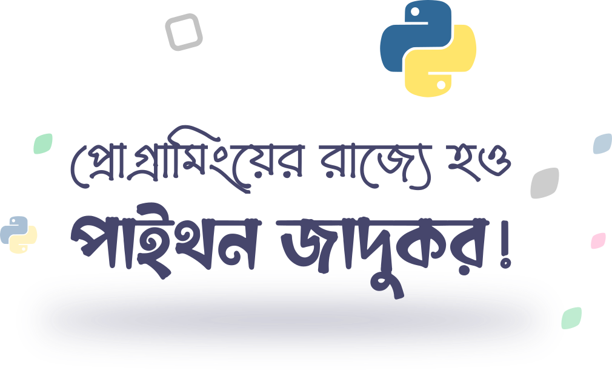

# Lecture - 1
- Introduction
- Installing Python
- Hello world program

___

# Who this course is for
- যারা প্রোগ্রামার হতে চাও
- যারা দৈনন্দিন জীবনের অনেক কাজ অটোমেট করতে চাও
- যারা কম্পিউটার সায়েন্টিস্টের মতন চিন্তা করতে চাও
- যারা বন্ধুদের ইম্প্রেস করতে চাও

---

# Prequisites

ABSOLUTELY NOTHING!

---

# Course structure
- কোর্সটি দুইভাগে বিভক্ত
- **প্রথম** ৭টি লেকচারে আমরা শিখবো পাইথনের ব্যাসিকস
- **দ্বিতীয়** ৭টি লেকচারে আমরা অসাম সব প্রোজেক্টস বানাবো
- দ্বিতীয় ভাগের পুরো একটি ক্লাসে দুষ্টু বন্ধুদের শায়েস্তা করার জন্য থাকবে প্র্যাংক প্রোগ্রামস

---

# **Superpowers** you will get
- নিজেকে *পাইথন প্রোগ্রামার* বলতে পারবে
- নিজে নিজে কম্পিউটারের বিভিন্ন সমস্যার সমাধান করতে পারবে
- বিভিন্ন প্রোজেক্টস বানাতে পারবে
- আরো এডভান্সড প্রোগ্রামিং শেখার জন্য তৈরি হবে
- বন্ধুদের কাছে ভীষণ ফ্লেক্স নিতে পারবে

Your imagination is the limit!

---

# Let's talk about **programming**

- প্রোগ্রামিং হলো কম্পিউটারকে কাজ করানো। প্রোগ্রামিং জানা থাকলে কম্পিউটারকে খুব প্রিসাইসলি নির্দেশনা দেওয়া যায়
- বিভিন্ন উপায় আছে সেই নির্দেশনা দেওয়ার, তার মাঝে একটি হলো পাইথন প্রোগ্রামিং

---

# Why **Python**

- পাইথন অপেক্ষাকৃত সহজ
- মডার্ন ল্যাঙ্গুয়েজ (অনেক ফিচার্স)
- ডাটা সায়েন্স, রোবোটিকস, ওয়েব ডেভেলপমেন্ট, গেইম ডেভেলপমেন্ট ছাড়াও অনেক ক্ষেত্রে ব্যবহার আছে
- পাইথন ডেভেলপার্সদের বর্তমানে প্রচুর চাহিদা
- প্রথম ল্যাঙ্গুয়েজ হিসেবে খুব ভালো

---

# Things we shall do today

- পাইথন ইনস্টল করবো
- আইডিই(IDE) সম্পর্কে জানবো
- ভিএসকোড(VSCode) ইনস্টল করবো
- পাইথন ডেভেলপমেন্টের জন্য VSCode গোছাবো
- পাইথন প্রোগ্রাম রান করা শিখবো
- হেলো ওয়ার্ল্ড প্রোগ্রাম লিখবো ও রান করবো
